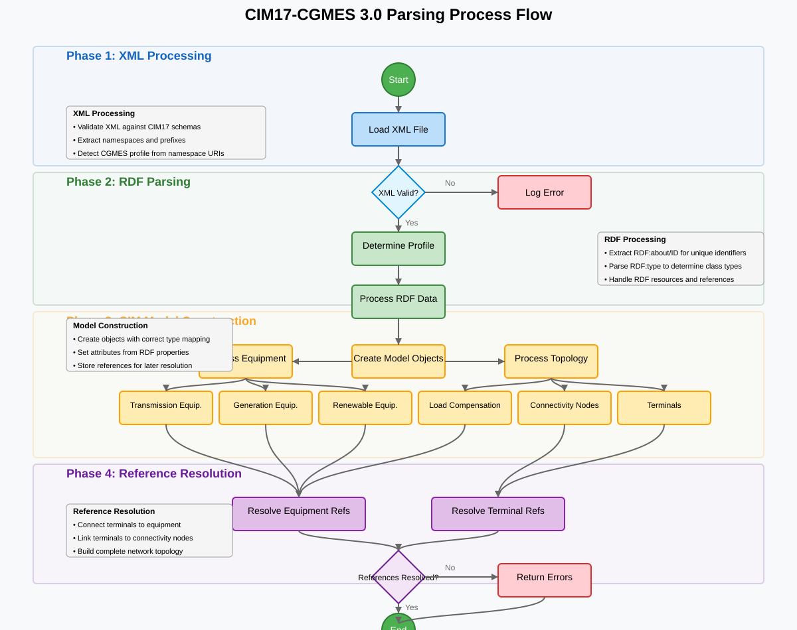
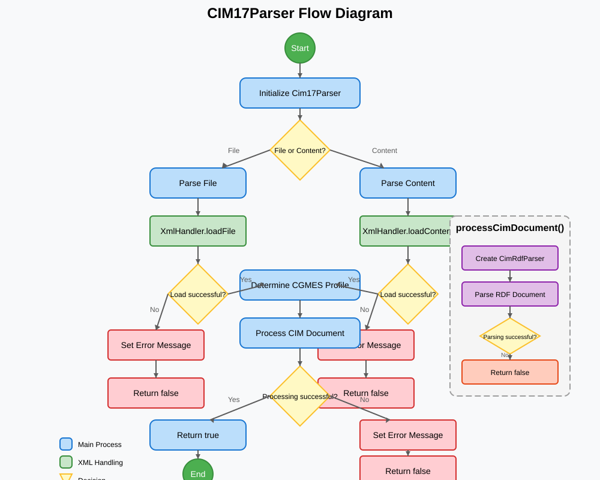

# CIM17Parser

A C++ library for parsing CGMES v3/CIM17 XML files used in power systems.

## Overview

CIM17Parser is a specialized library designed to parse and process CGMES v3 (Common Grid Model Exchange Standard version 3) XML files that follow the CIM17 (Common Information Model 17) model. This library provides a robust framework for loading, parsing, and processing power system data encoded in the CIM17 format.



## Features

- Parse CGMES v3/CIM17 XML files from file or string content
- Support for all CGMES v3 profiles (EQ, TP, SSH, SV, DY, GL, DL, EQBD, TPBD, OP, SC)
- Automatic profile detection from the XML document
- Optional XML validation against schemas
- Comprehensive error handling and reporting
- Object-oriented representation of the CIM17 model
- Support for power system equipment objects (ACLineSegment, PowerTransformer, etc.)
- References resolution between objects

## Architecture

The library follows a modular architecture with clear separation of concerns:

1. **XML Processing** - Handles the low-level XML parsing using the pugixml library
2. **RDF Parsing** - Processes the RDF structure of the CIM17 model
3. **Model Construction** - Creates and manages CIM objects based on the parsed data
4. **Profile Management** - Handles CGMES profile detection and validation

The processing flow is as follows:



## Class Structure

### Main Classes

- **Cim17Parser** - Main entry point for parsing CIM17 files
- **XmlHandler** - Handles XML document loading and basic processing
- **CimRdfParser** - Parses RDF content and creates CIM objects
- **CimModel** - Stores and manages all parsed CIM objects
- **CgmesProfileInfo** - Utilities for CGMES profile handling

### Domain Model Classes

- **CimIdentifiedObject** - Base class for all CIM objects with an identifier
- **CimEquipment** - Base class for power system equipment
- **Specialized equipment classes** - ACLineSegment, PowerTransformer, SynchronousMachine, etc.

## Usage

```cpp
#include "cim17/Cim17Parser.hpp"
#include <iostream>

int main() {
    // Create parser
    cim17::Cim17Parser parser;
    
    // Enable validation if needed
    parser.setValidationMode(true);
    
    // Parse a file
    if (!parser.parseFile("path/to/cim17_file.xml")) {
        std::cerr << "Error parsing file: " << parser.getLastError() << std::endl;
        return 1;
    }
    
    // Get the model and inspect objects
    cim17::CimModel& model = parser.getModel();
    
    // Print the profile
    std::cout << "Detected profile: " << 
        cim17::CgmesProfileInfo::toString(parser.getProfile()) << std::endl;
    
    // Get objects by type
    auto acLines = model.getObjectsByType<cim17::ACLineSegment>();
    std::cout << "Number of AC line segments: " << acLines.size() << std::endl;
    
    return 0;
}
```

## Dependencies

- **pugixml** - For XML parsing
- **spdlog** - For logging

## Building

The library uses CMake as its build system. To build:

```bash
mkdir build && cd build
cmake ..
make
```

## Security Considerations

When working with CIM17Parser, please be aware of the following security considerations:

1. **Input Validation** - Always validate input files before processing, as malicious XML files could potentially lead to security issues.
2. **Memory Management** - The library uses smart pointers to prevent memory leaks, but be careful when managing CIM objects manually.
3. **XML Entity Handling** - XML entity expansion attacks are mitigated by pugixml, but caution is still advised.
4. **Error Handling** - Always check return values and error messages to ensure proper error handling.

See the [Security Analysis](SECURITY.md) document for more details.

## License

[Your License Here]

## Contributing

[Your contribution guidelines here]
