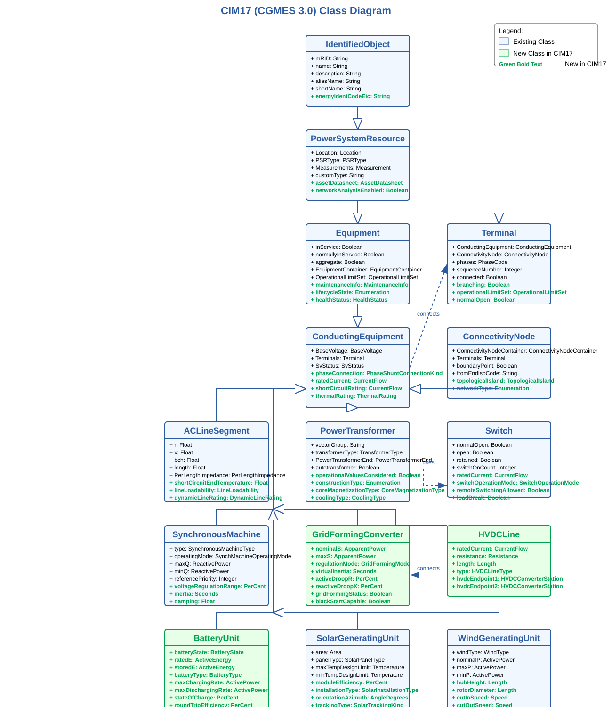

# Comparison of Equipment Classes: CIM16 (CGMES v2.4.15) vs CIM17 (CGMES 3.0)

This document provides a detailed comparison of equipment class attributes between CIM16 (CGMES v2.4.15) and CIM17 (CGMES 3.0) standards.

# CIM17 Equipment Profile UML Diagram

## Table of Contents

1. [Base Classes](#base-classes)
   - [IdentifiedObject](#identifiedobject)
   - [PowerSystemResource](#powersystemresource)
   - [Equipment](#equipment)
   - [ConductingEquipment](#conductingequipment)

2. [Core Network Classes](#core-network-classes)
   - [Terminal](#terminal)
   - [ConnectivityNode](#connectivitynode)
   - [TopologicalNode](#topologicalnode)

3. [Transmission Equipment](#transmission-equipment)
   - [ACLineSegment](#aclinesegment)
   - [PowerTransformer](#powertransformer)
   - [PowerTransformerEnd](#powertransformerend)
   - [Switch](#switch)
   - [Breaker](#breaker)
   - [Disconnector](#disconnector)
   - [BusbarSection](#busbarsection)

4. [Generation Equipment](#generation-equipment)
   - [SynchronousMachine](#synchronousmachine)
   - [AsynchronousMachine](#asynchronousmachine)
   - [GeneratingUnit](#generatingunit)

5. [Renewable Energy Resources](#renewable-energy-resources)
   - [PowerElectronicsConnection](#powerelectronicsconnection)
   - [PowerElectronicsUnit](#powerelectronicsunit)
   - [SolarGeneratingUnit](#solargeneratingunit)
   - [WindGeneratingUnit](#windgeneratingunit)

6. [Loads and Compensation](#loads-and-compensation)
   - [EnergyConsumer](#energyconsumer)
   - [ShuntCompensator](#shuntcompensator)
   - [SeriesCompensator](#seriescompensator)
   - [StaticVarCompensator](#staticvarcompensator)

--- 

## Base Classes

### IdentifiedObject

| Attribute | CIM16 (CGMES v2.4.15) | CIM17 (CGMES 3.0) | Change Description |
|-----------|------------------------|-------------------|---------------------|
| mRID | String, Master Resource Identifier | String, Master Resource Identifier | No change |
| name | String, Human-readable name | String, Human-readable name | No change |
| description | String, Description of object | String, Description of object | No change |
| aliasName | String, Alternative name | String, Alternative name | No change |
| shortName | String, Abbreviated name | String, Abbreviated name | No change |
| energyIdentCodeEic | Not present | String, Energy Identification Code | **Added in CIM17** |
| nationalGridEicCode | Present | Removed | **Removed in CIM17**, replaced by energyIdentCodeEic |
| localName | Present | Present | No change |

### PowerSystemResource

| Attribute | CIM16 (CGMES v2.4.15) | CIM17 (CGMES 3.0) | Change Description |
|-----------|------------------------|-------------------|---------------------|
| *Inherits from* | IdentifiedObject | IdentifiedObject | No change |
| Location | Association to Location | Association to Location | No change |
| PSRType | Association to PSRType | Association to PSRType | No change |
| Measurements | Association to Measurements | Association to Measurements | No change |
| customType | String, User-defined type | String, User-defined type | No change |
| assetDatasheet | Not present | Association to AssetDatasheet | **Added in CIM17** for asset integration |
| networkAnalysisEnabled | Not present | Boolean, flag for network analysis | **Added in CIM17** |
| operationalLimitSet | Basic support | Enhanced support | **Enhanced in CIM17** |

### Equipment

| Attribute | CIM16 (CGMES v2.4.15) | CIM17 (CGMES 3.0) | Change Description |
|-----------|------------------------|-------------------|---------------------|
| *Inherits from* | PowerSystemResource | PowerSystemResource | No change |
| inService | Boolean, operational state | Boolean, operational state | No change |
| normallyInService | Boolean, normal operational state | Boolean, normal operational state | No change |
| aggregate | Boolean, aggregated representation | Boolean, aggregated representation | No change |
| EquipmentContainer | Association to EquipmentContainer | Association to EquipmentContainer | No change |
| OperationalLimitSet | Association to OperationalLimitSet | Association to OperationalLimitSet | No change |
| contingencyEquipment | Association to ContingencyEquipment | Association to ContingencyEquipment | No change | 
| maintenanceInfo | Not present | Association to MaintenanceInfo | **Added in CIM17** |
| lifecycleState | Not present | Enumeration for asset lifecycle state | **Added in CIM17** |
| healthStatus | Not present | Association to HealthStatus | **Added in CIM17** |
| operationalRestrictions | Not present | String, operational restrictions | **Added in CIM17** |

### ConductingEquipment

| Attribute | CIM16 (CGMES v2.4.15) | CIM17 (CGMES 3.0) | Change Description |
|-----------|------------------------|-------------------|---------------------|
| *Inherits from* | Equipment | Equipment | No change |
| BaseVoltage | Association to BaseVoltage | Association to BaseVoltage | No change |
| Terminals | Association to Terminal | Association to Terminal | No change |
| SvStatus | Association to SvStatus | Association to SvStatus | No change |
| phaseConnection | Not present | PhaseShuntConnectionKind, type of phase connection | **Added in CIM17** |
| ratedCurrent | Not present | CurrentFlow, rated current | **Added in CIM17** |
| shortCircuitRating | Not present | CurrentFlow, short circuit rating | **Added in CIM17** |
| networkAnalysisEnabled | Not present | Boolean, flag for network analysis | **Added in CIM17** |
| thermalRating | Not present | Association to ThermalRating | **Added in CIM17** |

---

## Core Network Classes

### Terminal

| Attribute | CIM16 (CGMES v2.4.15) | CIM17 (CGMES 3.0) | Change Description |
|-----------|------------------------|-------------------|---------------------|
| *Inherits from* | IdentifiedObject | IdentifiedObject | No change |
| ConductingEquipment | Association to ConductingEquipment | Association to ConductingEquipment | No change |
| ConnectivityNode | Association to ConnectivityNode | Association to ConnectivityNode | No change |
| TopologicalNode | Association to TopologicalNode | Association to TopologicalNode | No change |
| phases | PhaseCode enumeration | PhaseCode enumeration | Enhanced with more phase combinations in CIM17 |
| sequenceNumber | Integer, sequence number | Integer, sequence number | No change |
| connected | Boolean, connection status | Boolean, connection status | No change |
| branching | Not present | Boolean, branching terminal indicator | **Added in CIM17** |
| operationalLimitSet | Not present | Association to OperationalLimitSet | **Added in CIM17** |
| measurements | Limited association | Enhanced association | **Enhanced in CIM17** |
| normalOpen | Not present | Boolean, normally open status | **Added in CIM17** |
| ipMax | Not present | CurrentFlow, maximum current | **Added in CIM17** |

### ConnectivityNode

| Attribute | CIM16 (CGMES v2.4.15) | CIM17 (CGMES 3.0) | Change Description |
|-----------|------------------------|-------------------|---------------------|
| *Inherits from* | IdentifiedObject | IdentifiedObject | No change |
| ConnectivityNodeContainer | Association to ConnectivityNodeContainer | Association to ConnectivityNodeContainer | No change |
| Terminals | Association to Terminal | Association to Terminal | No change |
| boundaryPoint | Boolean, cross-boundary indicator | Boolean, cross-boundary indicator | No change |
| fromEndIsoCode | String, ISO code for 'from' region | String, ISO code for 'from' region | No change |
| toEndIsoCode | String, ISO code for 'to' region | String, ISO code for 'to' region | No change |
| fromEndName | String, name of 'from' end | String, name of 'from' end | No change |
| toEndName | String, name of 'to' end | String, name of 'to' end | No change |
| topologicalIsland | Not present | Association to TopologicalIsland | **Added in CIM17** |
| networkType | Not present | Enumeration of network types | **Added in CIM17** to distinguish between transmission/distribution |

### TopologicalNode

| Attribute | CIM16 (CGMES v2.4.15) | CIM17 (CGMES 3.0) | Change Description |
|-----------|------------------------|-------------------|---------------------|
| *Inherits from* | IdentifiedObject | IdentifiedObject | No change |
| ConnectivityNodeContainer | Association to ConnectivityNodeContainer | Association to ConnectivityNodeContainer | No change |
| Terminal | Association to Terminal | Association to Terminal | No change |
| AngleRefTopologicalIsland | Association to TopologicalIsland | Association to TopologicalIsland | No change |
| BaseVoltage | Association to BaseVoltage | Association to BaseVoltage | No change |
| TopologicalIsland | Association to TopologicalIsland | Association to TopologicalIsland | No change |
| boundaryPoint | Boolean, cross-boundary indicator | Boolean, cross-boundary indicator | No change |
| fromEndIsoCode | String, ISO code for 'from' region | String, ISO code for 'from' region | No change |
| toEndIsoCode | String, ISO code for 'to' region | String, ISO code for 'to' region | No change |
| fromEndName | String, name of 'from' end | String, name of 'from' end | No change |
| toEndName | String, name of 'to' end | String, name of 'to' end | No change |
| svInjection | Association to SvInjection | Association to SvInjection | No change |
| svVoltage | Association to SvVoltage | Association to SvVoltage | No change |
| networkType | Not present | Enumeration of network types | **Added in CIM17** |
| islandNumber | Not present | Integer, island identifier | **Added in CIM17** |
| slackBusIndicator | Not present | Boolean, slack bus indicator | **Added in CIM17** |
| zonalAggregate | Not present | Boolean, zonal aggregation indicator | **Added in CIM17** |

---

## Transmission Equipment

### ACLineSegment

| Attribute | CIM16 (CGMES v2.4.15) | CIM17 (CGMES 3.0) | Change Description |
|-----------|------------------------|-------------------|---------------------|
| *Inherits from* | ConductingEquipment | ConductingEquipment | No change |
| r | Float, positive sequence resistance | Float, positive sequence resistance | No change |
| x | Float, positive sequence reactance | Float, positive sequence reactance | No change |
| bch | Float, positive sequence shunt susceptance | Float, positive sequence shunt susceptance | No change |
| gch | Float, positive sequence shunt conductance | Float, positive sequence shunt conductance | No change |
| r0 | Float, zero sequence resistance | Float, zero sequence resistance | No change |
| x0 | Float, zero sequence reactance | Float, zero sequence reactance | No change |
| b0ch | Float, zero sequence shunt susceptance | Float, zero sequence shunt susceptance | No change |
| g0ch | Float, zero sequence shunt conductance | Float, zero sequence shunt conductance | No change |
| length | Float, segment length | Float, segment length | No change |
| shortCircuitEndTemperature | Not present | Float, max temp during short circuit | **Added in CIM17** |
| PerLengthImpedance | Optional | Mandatory | **Changed to mandatory in CIM17** |
| lineLoadability | Not present | Association to LineLoadability | **Added in CIM17** |
| dynamicLineRating | Not present | Association to DynamicLineRating | **Added in CIM17** |
| environmentalMonitor | Not present | Association to EnvironmentalMonitor | **Added in CIM17** |

### PowerTransformer

| Attribute | CIM16 (CGMES v2.4.15) | CIM17 (CGMES 3.0) | Change Description |
|-----------|------------------------|-------------------|---------------------|
| *Inherits from* | ConductingEquipment | ConductingEquipment | No change |
| vectorGroup | String, vector group code | String, vector group code | No change |
| transformerType | TransformerType enumeration | TransformerType enumeration | Extended in CIM17 |
| PowerTransformerEnd | Association to PowerTransformerEnd | Association to PowerTransformerEnd | No change |
| isPartOfGeneratorUnit | Boolean | Boolean | No change |
| beforeShCircuitHighestOperatingVoltage | Voltage | Voltage | No change |
| highSideMinOperatingU | Voltage | Voltage | No change |
| beforeShortCircuitAnglePf | AngleDegrees | AngleDegrees | No change |
| autotransformer | Boolean | Boolean | No change |
| operationalValuesConsidered | Not present | Boolean, flag for operational values | **Added in CIM17** |
| constructionType | Not present | Enumeration of construction types | **Added in CIM17** |
| coreMagnetizationType | Not present | CoreMagnetizationType enumeration | **Added in CIM17** |
| tapChangerScaling | Not present | Float, tap changer scaling factor | **Added in CIM17** |
| emergencyRating | Not present | ApparentPower, emergency rating | **Added in CIM17** |
| coolingType | Not present | CoolingType enumeration | **Added in CIM17** |

### PowerTransformerEnd

| Attribute | CIM16 (CGMES v2.4.15) | CIM17 (CGMES 3.0) | Change Description |
|-----------|------------------------|-------------------|---------------------|
| *Inherits from* | IdentifiedObject | IdentifiedObject | No change |
| PowerTransformer | Association to PowerTransformer | Association to PowerTransformer | No change |
| Terminal | Association to Terminal | Association to Terminal | No change |
| endNumber | Integer, transformer end number | Integer, transformer end number | No change |
| ratedU | Voltage, rated voltage | Voltage, rated voltage | No change |
| r | Resistance, winding resistance | Resistance, winding resistance | No change |
| x | Reactance, leakage reactance | Reactance, leakage reactance | No change |
| r0 | Resistance, zero sequence resistance | Resistance, zero sequence resistance | No change |
| x0 | Reactance, zero sequence reactance | Reactance, zero sequence reactance | No change |
| g | Conductance, magnetizing conductance | Conductance, magnetizing conductance | No change |
| b | Susceptance, magnetizing susceptance | Susceptance, magnetizing susceptance | No change |
| g0 | Conductance, zero sequence magnetizing conductance | Conductance, zero sequence magnetizing conductance | No change |
| b0 | Susceptance, zero sequence magnetizing susceptance | Susceptance, zero sequence magnetizing susceptance | No change |
| phaseAngleClock | Integer, phase angle in hours (0-11) | Integer, phase angle in hours (0-11) | No change |
| connectionKind | WindingConnection, type of connection | WindingConnection, type of connection | Enhanced in CIM17 |
| ratedS | Not present | ApparentPower, rated power | **Added in CIM17** |
| rground | Not present | Resistance, grounding resistance | **Added in CIM17** |
| xground | Not present | Reactance, grounding reactance | **Added in CIM17** |
| windingInsulationU | Not present | Voltage, winding insulation voltage | **Added in CIM17** |
| emergencyRating | Not present | ApparentPower, emergency rating | **Added in CIM17** |
| shortTermRating | Not present | ApparentPower, short term rating | **Added in CIM17** |

### Switch

| Attribute | CIM16 (CGMES v2.4.15) | CIM17 (CGMES 3.0) | Change Description |
|-----------|------------------------|-------------------|---------------------|
| *Inherits from* | ConductingEquipment | ConductingEquipment | No change |
| normalOpen | Boolean, normally open status | Boolean, normally open status | No change |
| open | Boolean, current open status | Boolean, current open status | No change |
| retained | Boolean, retained state | Boolean, retained state | No change |
| switchOnCount | Integer, switch operation count | Integer, switch operation count | No change |
| switchOnDate | DateTime, last switched on date | DateTime, last switched on date | No change |
| ratedCurrent | Not present | CurrentFlow, rated current | **Added in CIM17** |
| switchOperationMode | Not present | SwitchOperationMode enumeration | **Added in CIM17** |
| remoteSwitchingAllowed | Not present | Boolean, remote switching allowed | **Added in CIM17** |
| loadBreak | Not present | Boolean, load breaking capability | **Added in CIM17** |
| operatingMode | Not present | OperatingMode enumeration | **Added in CIM17** |
| withstandCurrent | Not present | CurrentFlow, withstand current | **Added in CIM17** |

### Breaker

| Attribute | CIM16 (CGMES v2.4.15) | CIM17 (CGMES 3.0) | Change Description |
|-----------|------------------------|-------------------|---------------------|
| *Inherits from* | Switch | Switch | No change |
| breakingCapacity | CurrentFlow, maximum current | CurrentFlow, maximum current | No change |
| inTransitTime | Seconds, transition time | Seconds, transition time | No change |
| recloseSequences | Not present | Integer, number of reclose sequences | **Added in CIM17** |
| recloseDelay | Not present | Seconds, reclosing delay | **Added in CIM17** |
| phaseTrip | Not present | PhaseCode, tripped phases | **Added in CIM17** |
| operationCycleCount | Not present | Integer, operation cycle count | **Added in CIM17** |
| switchingTechnology | Not present | SwitchingTechnology enumeration | **Added in CIM17** |
| ratedInterruptingTime | Not present | Seconds, rated interrupting time | **Added in CIM17** |

### Disconnector

| Attribute | CIM16 (CGMES v2.4.15) | CIM17 (CGMES 3.0) | Change Description |
|-----------|------------------------|-------------------|---------------------|
| *Inherits from* | Switch | Switch | No change |
| switchingOperation | Not present | SwitchingOperationKind enumeration | **Added in CIM17** |
| interlockScheme | Not present | InterlockSchemeKind enumeration | **Added in CIM17** |
| loadDropCompensation | Not present | Boolean, load drop compensation | **Added in CIM17** |
| earthingStatus | Not present | Boolean, earthing status | **Added in CIM17** |
| dCUngroundedOperation | Not present | Boolean, DC ungrounded operation | **Added in CIM17** |

### BusbarSection

| Attribute | CIM16 (CGMES v2.4.15) | CIM17 (CGMES 3.0) | Change Description |
|-----------|------------------------|-------------------|---------------------|
| *Inherits from* | ConductingEquipment | ConductingEquipment | No change |
| ipMax | CurrentFlow, maximum current | CurrentFlow, maximum current | No change |
| busbarConfiguration | Not present | BusbarConfiguration enumeration | **Added in CIM17** |
| ratedVoltage | Not present | Voltage, rated voltage | **Added in CIM17** |
| ratedCurrent | Not present | CurrentFlow, rated current | **Added in CIM17** |
| material | Not present | BusbarMaterial enumeration | **Added in CIM17** |
| busColor | Not present | String, color designation | **Added in CIM17** |
| insulationMaterial | Not present | InsulationMaterial enumeration | **Added in CIM17** |

---

## Generation Equipment

### SynchronousMachine

| Attribute | CIM16 (CGMES v2.4.15) | CIM17 (CGMES 3.0) | Change Description |
|-----------|------------------------|-------------------|---------------------|
| *Inherits from* | RotatingMachine | RotatingMachine | No change |
| type | SynchronousMachineType enumeration | SynchronousMachineType enumeration | Enhanced in CIM17 |
| operatingMode | SynchronousMachineOperatingMode enumeration | SynchronousMachineOperatingMode enumeration | No change |
| earthing | Boolean, grounding indicator | Boolean, grounding indicator | No change |
| earthingStarPointR | Resistance, grounding resistance | Resistance, grounding resistance | No change |
| earthingStarPointX | Reactance, grounding reactance | Reactance, grounding reactance | No change |
| r | Resistance, positive sequence resistance | Resistance, positive sequence resistance | No change |
| x | Reactance, positive sequence reactance | Reactance, positive sequence reactance | No change |
| r0 | Resistance, zero sequence resistance | Resistance, zero sequence resistance | No change |
| x0 | Reactance, zero sequence reactance | Reactance, zero sequence reactance | No change |
| r2 | Resistance, negative sequence resistance | Resistance, negative sequence resistance | No change |
| x2 | Reactance, negative sequence reactance | Reactance, negative sequence reactance | No change |
| maxQ | ReactivePower, maximum reactive power | ReactivePower, maximum reactive power | No change |
| minQ | ReactivePower, minimum reactive power | ReactivePower, minimum reactive power | No change |
| qPercent | PerCent, reactive power percent | PerCent, reactive power percent | No change |
| referencePriority | Integer, priority for voltage control | Integer, priority for voltage control | No change |
| satDirectSubtransX | Not present | PU, direct-axis subtransient reactance saturation | **Added in CIM17** |
| satDirectSyncX | Not present | PU, direct-axis synchronous reactance saturation | **Added in CIM17** |
| satDirectTransX | Not present | PU, direct-axis transient reactance saturation | **Added in CIM17** |
| shortCircuitRotorType | Not present | ShortCircuitRotorKind enumeration | **Added in CIM17** |
| voltageRegulationRange | Not present | PerCent, voltage regulation range | **Added in CIM17** |
| damping | Not present | Float, damping factor | **Added in CIM17** |
| inertia | Not present | Seconds, inertia constant | **Added in CIM17** for stability studies |

### AsynchronousMachine

| Attribute | CIM16 (CGMES v2.4.15) | CIM17 (CGMES 3.0) | Change Description |
|-----------|------------------------|-------------------|---------------------|
| *Inherits from* | RotatingMachine | RotatingMachine | No change |
| nominalSpeed | RotationSpeed, nominal rotational speed | RotationSpeed, nominal rotational speed | No change |
| nominalFrequency | Frequency, nominal frequency | Frequency, nominal frequency | No change |
| nominalP | ActivePower, nominal active power | ActivePower, nominal active power | No change |
| nominalQ | ReactivePower, nominal reactive power | ReactivePower, nominal reactive power | No change |
| efficiency | PerCent, efficiency of the machine | PerCent, efficiency of the machine | No change |
| iaIrRatio | Float, ratio of locked-rotor current to rated current | Float, ratio of locked-rotor current to rated current | No change |
| polePairNumber | Integer, number of pole pairs | Integer, number of pole pairs | No change |
| ratedMechanicalPower | ActivePower, rated mechanical power | ActivePower, rated mechanical power | No change |
| reversible | Boolean, reversible machine | Boolean, reversible machine | No change |
| converterFedDrive | Boolean, converter fed | Boolean, converter fed | No change |
| asynchronousMachineType | AsynchronousMachineKind, basic types | AsynchronousMachineKind, expanded types | **Enhanced in CIM17** with more types |
| powerFactorRegulation | Not present | Boolean, power factor regulation | **Added in CIM17** |
| slipBehaviour | Not present | SlipBehaviour enumeration | **Added in CIM17** |
| startingMethod | Not present | StartingMethodKind enumeration | **Added in CIM17** |
| coolingSystem | Not present | CoolingSystem enumeration | **Added in CIM17** |
| torqueSpeedCurve | Not present | Association to TorqueSpeedCurve | **Added in CIM17** |

### GeneratingUnit

| Attribute | CIM16 (CGMES v2.4.15) | CIM17 (CGMES 3.0) | Change Description |
|-----------|------------------------|-------------------|---------------------|
| *Inherits from* | Equipment | Equipment | No change |
| maxOperatingP | ActivePower, maximum operating power | ActivePower, maximum operating power | No change |
| minOperatingP | ActivePower, minimum operating power | ActivePower, minimum operating power | No change |
| nominalP | ActivePower, nominal power | ActivePower, nominal power | No change |
| ratedGrossMaxP | ActivePower, rated maximum gross power | ActivePower, rated maximum gross power | No change |
| ratedGrossMinP | ActivePower, rated minimum gross power | ActivePower, rated minimum gross power | No change |
| ratedNetMaxP | ActivePower, rated maximum net power | ActivePower, rated maximum net power | No change |
| genControlSource | GeneratorControlSource enumeration | GeneratorControlSource enumeration | Enhanced in CIM17 |
| initialP | ActivePower, initial active power | ActivePower, initial active power | No change |
| longPF | Float, economic participation factor | Float, economic participation factor | No change |
| maximumAllowableSpinningReserve | ActivePower, maximum spinning reserve | ActivePower, maximum spinning reserve | No change |
| maxEconomicP | ActivePower, maximum economic power | ActivePower, maximum economic power | No change |
| minEconomicP | ActivePower, minimum economic power | ActivePower, minimum economic power | No change |
| totalEfficiency | PerCent, total fuel efficiency | PerCent, total fuel efficiency | No change |
| governorSCD | Boolean, governor speed changer droop | Boolean, governor speed changer droop | No change |
| controlResponseRate | Not present | ActivePowerPerMinute, control response rate | **Added in CIM17** |
| startupCost | Not present | Money, startup cost | **Added in CIM17** |
| variableCost | Not present | Money, variable cost | **Added in CIM17** |
| startupTime | Not present | Seconds, startup time | **Added in CIM17** |
| shutdownCost | Not present | Money, shutdown cost | **Added in CIM17** |
| fuelCost | Not present | Money, fuel cost | **Added in CIM17** |
| dispatchMode | Not present | GeneratorDispatchMode enumeration | **Added in CIM17** |
| operationalState | Limited | Enhanced | **Enhanced in CIM17** |

---

## Renewable Energy Resources

### PowerElectronicsConnection

| Attribute | CIM16 (CGMES v2.4.15) | CIM17 (CGMES 3.0) | Change Description |
|-----------|------------------------|-------------------|---------------------|
| *Inherits from* | ConductingEquipment | ConductingEquipment | No change |
| maxP | ActivePower, maximum active power | ActivePower, maximum active power | No change |
| minP | ActivePower, minimum active power | ActivePower, minimum active power | No change |
| maxQ | ReactivePower, maximum reactive power | ReactivePower, maximum reactive power | No change |
| minQ | ReactivePower, minimum reactive power | ReactivePower, minimum reactive power | No change |
| p | ActivePower, active power injection | ActivePower, active power injection | No change |
| q | ReactivePower, reactive power injection | ReactivePower, reactive power injection | No change |
| r | Resistance, resistance of connection | Resistance, resistance of connection | No change |
| x | Reactance, reactance of connection | Reactance, reactance of connection | No change |
| ratedS | ApparentPower, rated apparent power | ApparentPower, rated apparent power | No change |
| ratedU | Voltage, rated voltage | Voltage, rated voltage | No change |
| PowerElectronicsUnit | Association to PowerElectronicsUnit | Association to PowerElectronicsUnit | No change |
| controlMode | Not present | PowerElectronicsControlMode enumeration | **Added in CIM17** |
| gridSupport | Not present | Boolean, grid support capability | **Added in CIM17** |
| inverterType | Not present | InverterType enumeration | **Added in CIM17** |
| gridFormingMode | Not present | Boolean, grid forming capability | **Added in CIM17** |
| powerRampRate | Not present | ActivePowerPerMinute, power ramp rate | **Added in CIM17** |
| operatingState | Not present | OperatingState enumeration | **Added in CIM17** |

### PowerElectronicsUnit

| Attribute | CIM16 (CGMES v2.4.15) | CIM17 (CGMES 3.0) | Change Description |
|-----------|------------------------|-------------------|---------------------|
| *Inherits from* | Equipment | Equipment | No change |
| PowerElectronicsConnection | Association to PowerElectronicsConnection | Association to PowerElectronicsConnection | No change |
| maxP | ActivePower, maximum active power | ActivePower, maximum active power | No change |
| minP | ActivePower, minimum active power | ActivePower, minimum active power | No change |
| manufacturerName | Not present | String, manufacturer name | **Added in CIM17** |
| manufacturerModel | Not present | String, manufacturer model | **Added in CIM17** |
| manufacturerRatedS | Not present | ApparentPower, manufacturer rated apparent power | **Added in CIM17** |
| thermalOverloadRating | Not present | PerCent, thermal overload rating | **Added in CIM17** |
| efficiencyCurve | Not present | Association to EfficiencyCurve | **Added in CIM17** |
| powerElectronicsType | Not present | PowerElectronicsType enumeration | **Added in CIM17** |
| harmonicModel | Not present | Association to HarmonicModel | **Added in CIM17** |

### SolarGeneratingUnit

| Attribute | CIM16 (CGMES v2.4.15) | CIM17 (CGMES 3.0) | Change Description |
|-----------|------------------------|-------------------|---------------------|
| *Inherits from* | PowerElectronicsUnit | PowerElectronicsUnit | No change |
| area | Area, surface area of solar panels | Area, surface area of solar panels | No change |
| panelType | SolarPanelType enumeration | SolarPanelType enumeration | Enhanced in CIM17 |
| maxTempDesignLimit | Temperature, maximum temperature design limit | Temperature, maximum temperature design limit | No change |
| minTempDesignLimit | Temperature, minimum temperature design limit | Temperature, minimum temperature design limit | No change |
| moduleType | Not present | SolarModuleType enumeration | **Added in CIM17** |
| moduleEfficiency | Not present | PerCent, module efficiency | **Added in CIM17** |
| installationType | Not present | SolarInstallationType enumeration | **Added in CIM17** |
| orientationAzimuth | Not present | AngleDegrees, orientation azimuth | **Added in CIM17** |
| orientationTilt | Not present | AngleDegrees, tilt angle | **Added in CIM17** |
| trackingType | Not present | SolarTrackingKind enumeration | **Added in CIM17** |
| temperatureCoefficient | Not present | Float, temperature coefficient | **Added in CIM17** |
| irradianceResponse | Not present | Association to IrradianceResponseCurve | **Added in CIM17** |
| degradationFactor | Not present | PerCent, annual degradation factor | **Added in CIM17** |

### WindGeneratingUnit

| Attribute | CIM16 (CGMES v2.4.15) | CIM17 (CGMES 3.0) | Change Description |
|-----------|------------------------|-------------------|---------------------|
| *Inherits from* | PowerElectronicsUnit | PowerElectronicsUnit | No change |
| windType | WindType enumeration | WindType enumeration | Enhanced in CIM17 |
| nominalP | ActivePower, nominal active power | ActivePower, nominal active power | No change |
| maxP | ActivePower, maximum active power | ActivePower, maximum active power | No change |
| minP | ActivePower, minimum active power | ActivePower, minimum active power | No change |
| windTurbineType1or2 | WindTurbineType1or2 | WindTurbineType1or2 | Enhanced in CIM17 |
| windTurbineType3or4 | WindTurbineType3or4 | WindTurbineType3or4 | Enhanced in CIM17 |
| hubHeight | Not present | Length, hub height | **Added in CIM17** |
| rotorDiameter | Not present | Length, rotor diameter | **Added in CIM17** |
| windPowercurve | Not present | Association to WindPowerCurve | **Added in CIM17** |
| minOperatingSpeed | Not present | RotationSpeed, min operating speed | **Added in CIM17** |
| maxOperatingSpeed | Not present | RotationSpeed, max operating speed | **Added in CIM17** |
| cutInSpeed | Not present | Speed, cut-in wind speed | **Added in CIM17** |
| cutOutSpeed | Not present | Speed, cut-out wind speed | **Added in CIM17** |
| lowVoltageRideThrough | Not present | Boolean, low voltage ride through | **Added in CIM17** |
| inertiaConstant | Not present | Seconds, inertia constant | **Added in CIM17** |
| technicalLifeYears | Not present | Years, technical lifetime | **Added in CIM17** |

---

## Loads and Compensation

### EnergyConsumer

| Attribute | CIM16 (CGMES v2.4.15) | CIM17 (CGMES 3.0) | Change Description |
|-----------|------------------------|-------------------|---------------------|
| *Inherits from* | ConductingEquipment | ConductingEquipment | No change |
| p | ActivePower, active power | ActivePower, active power | No change |
| q | ReactivePower, reactive power | ReactivePower, reactive power | No change |
| pfixed | ActivePower, fixed active power | ActivePower, fixed active power | No change |
| qfixed | ReactivePower, fixed reactive power | ReactivePower, fixed reactive power | No change |
| LoadResponse | Association to LoadResponse | Association to LoadResponse | No change |
| LoadGroup | Association to LoadGroup | Association to LoadGroup | No change |
| pfixedPct | PerCent, fixed active power percentage | PerCent, fixed active power percentage | No change |
| qfixedPct | PerCent, fixed reactive power percentage | PerCent, fixed reactive power percentage | No change |
| pfexp | Float, active exp. p voltage dependence | Float, active exp. p voltage dependence | No change |
| qfexp | Float, reactive exp. q voltage dependence | Float, reactive exp. q voltage dependence | No change |
| loadType | Not present | LoadType enumeration | **Added in CIM17** |
| powerCutZone | Not present | Association to PowerCutZone | **Added in CIM17** |
| priorityRanking | Not present | Integer, priority ranking | **Added in CIM17** |
| phasesConnected | Not present | PhaseCode, connected phases | **Added in CIM17** |
| customerCount | Not present | Integer, customer count | **Added in CIM17** |
| grounded | Not present | Boolean, grounded status | **Added in CIM17** |
| phaseConnection | Not present | PhaseShuntConnectionKind enumeration | **Added in CIM17** |
| zipLoadModel | Not present | Association to ZIPLoadModel | **Added in CIM17** |

### ShuntCompensator

| Attribute | CIM16 (CGMES v2.4.15) | CIM17 (CGMES 3.0) | Change Description |
|-----------|------------------------|-------------------|---------------------|
| *Inherits from* | ConductingEquipment | ConductingEquipment | No change |
| aVRDelay | Seconds, automatic voltage regulation delay | Seconds, automatic voltage regulation delay | No change |
| maximumSections | Integer, maximum number of sections | Integer, maximum number of sections | No change |
| nomU | Voltage, nominal voltage | Voltage, nominal voltage | No change |
| normalSections | Integer, normal number of sections in service | Integer, normal number of sections in service | No change |
| sections | Float, number of sections in service | Float, number of sections in service | No change |
| voltageSensitivity | VoltagePerReactivePower, voltage sensitivity | VoltagePerReactivePower, voltage sensitivity | No change |
| b | Susceptance, shunt susceptance | Susceptance, shunt susceptance | Enhanced in CIM17 |
| g | Conductance, shunt conductance | Conductance, shunt conductance | Enhanced in CIM17 |
| SvShuntCompensatorSections | Association to SvShuntCompensatorSections | Association to SvShuntCompensatorSections | No change |
| regulationStatus | Not present | Boolean, regulation status | **Added in CIM17** |
| controlMode | Not present | ShuntCompensatorControlMode enumeration | **Added in CIM17** |
| phaseConnection | Not present | PhaseShuntConnectionKind enumeration | **Added in CIM17** |
| grounded | Not present | Boolean, grounded | **Added in CIM17** |
| nomQ | Not present | ReactivePower, nominal reactive power | **Added in CIM17** |
| switchingOnCount | Not present | Integer, switching on count | **Added in CIM17** |
| switchOnDate | Not present | DateTime, switch on date | **Added in CIM17** |
| compensatorType | Not present | ShuntCompensatorKind enumeration | **Added in CIM17** |

### SeriesCompensator

| Attribute | CIM16 (CGMES v2.4.15) | CIM17 (CGMES 3.0) | Change Description |
|-----------|------------------------|-------------------|---------------------|
| *Inherits from* | ConductingEquipment | ConductingEquipment | No change |
| r | Resistance, positive sequence resistance | Resistance, positive sequence resistance | No change |
| x | Reactance, positive sequence reactance | Reactance, positive sequence reactance | No change |
| r0 | Resistance, zero sequence resistance | Resistance, zero sequence resistance | No change |
| x0 | Reactance, zero sequence reactance | Reactance, zero sequence reactance | No change |
| varistorPresent | Boolean, varistor presence | Boolean, varistor presence | No change |
| varistorRatedCurrent | CurrentFlow, varistor rated current | CurrentFlow, varistor rated current | No change |
| varistorVoltageThreshold | Voltage, varistor voltage threshold | Voltage, varistor voltage threshold | No change |
| compensationType | Not present | SeriesCompensatorType enumeration | **Added in CIM17** |
| controlMode | Not present | SeriesCompControlMode enumeration | **Added in CIM17** |
| nomQ | Not present | ReactivePower, nominal reactive power | **Added in CIM17** |
| maxValve | Not present | ReactivePower, max valves | **Added in CIM17** |
| fireProtectionType | Not present | FireProtectionKind enumeration | **Added in CIM17** |
| bypassStatus | Not present | Boolean, bypass status | **Added in CIM17** |
| operationalValuesConsidered | Not present | Boolean, operational values considered | **Added in CIM17** |
| coolingType | Not present | CoolingType enumeration | **Added in CIM17** |

### StaticVarCompensator

| Attribute | CIM16 (CGMES v2.4.15) | CIM17 (CGMES 3.0) | Change Description |
|-----------|------------------------|-------------------|---------------------|
| *Inherits from* | RegulatingCondEq | RegulatingCondEq | No change |
| sVCControlMode | SVCControlMode enumeration | SVCControlMode enumeration | Enhanced in CIM17 |
| reactiveCapacitance | Susceptance, maximum capacitive reactance | Susceptance, maximum capacitive reactance | No change |
| reactiveInductance | Susceptance, maximum inductive reactance | Susceptance, maximum inductive reactance | No change |
| voltageSetPoint | Voltage, voltage reference value | Voltage, voltage reference value | No change |
| slope | VoltagePerReactivePower, SVC slope | VoltagePerReactivePower, SVC slope | No change |
| capacitiveRating | Not present | Reactance, capacitive rating | **Added in CIM17** |
| inductiveRating | Not present | Reactance, inductive rating | **Added in CIM17** |
| sVCControlMode2 | Not present | SVCControlMode2 enumeration | **Added in CIM17** |
| lowVoltageBypass | Not present | Boolean, low voltage bypass | **Added in CIM17** |
| qcapacitorOrQmax | Not present | ReactivePower, capacitor rating or max rating | **Added in CIM17** |
| qinductorOrQmin | Not present | ReactivePower, inductor rating or min rating | **Added in CIM17** |
| tcrCurrentLimit | Not present | CurrentFlow, TCR current limit | **Added in CIM17** |
| sVCType | Not present | SVCType enumeration | **Added in CIM17** |
| valveMonitorNumber | Not present | Integer, valve monitor number | **Added in CIM17** |

## New Equipment Classes in CIM17

### HVDC Equipment

#### HVDCLine

| Attribute | CIM16 (CGMES v2.4.15) | CIM17 (CGMES 3.0) | Change Description |
|-----------|------------------------|-------------------|---------------------|
| *Inherits from* | Not present | Equipment | **New class in CIM17** |
| ratedCurrent | Not present | CurrentFlow, rated current | **New in CIM17** |
| resistance | Not present | Resistance, line resistance | **New in CIM17** |
| length | Not present | Length, line length | **New in CIM17** |
| capacitance | Not present | Capacitance, line capacitance | **New in CIM17** |
| inductance | Not present | Inductance, line inductance | **New in CIM17** |
| type | Not present | HVDCLineType enumeration | **New in CIM17** |
| dcPoleDCTerminals | Not present | Association to DCTerminal | **New in CIM17** |
| hvdcEndpoint1 | Not present | Association to HVDCConverterStation | **New in CIM17** |
| hvdcEndpoint2 | Not present | Association to HVDCConverterStation | **New in CIM17** |

#### HVDCConverterStation

| Attribute | CIM16 (CGMES v2.4.15) | CIM17 (CGMES 3.0) | Change Description |
|-----------|------------------------|-------------------|---------------------|
| *Inherits from* | Not present | ConductingEquipment | **New class in CIM17** |
| operatingMode | Not present | ConverterStationMode enumeration | **New in CIM17** |
| pQControlMode | Not present | PQControlMode enumeration | **New in CIM17** |
| ratedUdc | Not present | Voltage, rated DC voltage | **New in CIM17** |
| hvdcType | Not present | HVDCType enumeration | **New in CIM17** |
| targetUdc | Not present | Voltage, target DC voltage | **New in CIM17** |
| targetPpcc | Not present | ActivePower, target active power | **New in CIM17** |
| targetQpcc | Not present | ReactivePower, target reactive power | **New in CIM17** |
| lossFactor | Not present | PerCent, loss factor | **New in CIM17** |
| minUdc | Not present | Voltage, minimum DC voltage | **New in CIM17** |
| maxUdc | Not present | Voltage, maximum DC voltage | **New in CIM17** |
| HVDCLine | Not present | Association to HVDCLine | **New in CIM17** |

### Energy Storage

#### BatteryUnit

| Attribute | CIM16 (CGMES v2.4.15) | CIM17 (CGMES 3.0) | Change Description |
|-----------|------------------------|-------------------|---------------------|
| *Inherits from* | Not present | PowerElectronicsUnit | **New class in CIM17** |
| batteryState | Not present | BatteryState enumeration | **New in CIM17** |
| ratedE | Not present | ActiveEnergy, rated energy capacity | **New in CIM17** |
| storedE | Not present | ActiveEnergy, stored energy | **New in CIM17** |
| batteryType | Not present | BatteryType enumeration | **New in CIM17** |
| batteryCapacity | Not present | ElectricCharge, battery capacity | **New in CIM17** |
| maxChargingRate | Not present | ActivePower, max charging rate | **New in CIM17** |
| maxDischargingRate | Not present | ActivePower, max discharging rate | **New in CIM17** |
| cycleLifeRemaining | Not present | PerCent, cycle life remaining | **New in CIM17** |
| stateOfCharge | Not present | PerCent, state of charge | **New in CIM17** |
| roundTripEfficiency | Not present | PerCent, round trip efficiency | **New in CIM17** |
| cellVoltageV | Not present | Voltage, cell voltage | **New in CIM17** |
| cellCount | Not present | Integer, cell count | **New in CIM17** |
| cellTemperature | Not present | Temperature, cell temperature | **New in CIM17** |

### Grid-forming Components

#### GridFormingConverter

| Attribute | CIM16 (CGMES v2.4.15) | CIM17 (CGMES 3.0) | Change Description |
|-----------|------------------------|-------------------|---------------------|
| *Inherits from* | Not present | RegulatingCondEq | **New class in CIM17** |
| nominalS | Not present | ApparentPower, nominal apparent power | **New in CIM17** |
| maxS | Not present | ApparentPower, maximum apparent power | **New in CIM17** |
| regulationMode | Not present | GridFormingMode enumeration | **New in CIM17** |
| virtualInertia | Not present | Seconds, virtual inertia constant | **New in CIM17** |
| activeDroopR | Not present | PerCent, active droop R | **New in CIM17** |
| reactiveDroopX | Not present | PerCent, reactive droop X | **New in CIM17** |
| frequencyLimit | Not present | Frequency, frequency limit | **New in CIM17** |
| voltageLimit | Not present | Voltage, voltage limit | **New in CIM17** |
| currentLimit | Not present | CurrentFlow, current limit | **New in CIM17** |
| gridFormingStatus | Not present | Boolean, grid forming status | **New in CIM17** |
| primaryFreqResponsStatus | Not present | Boolean, primary frequency response status | **New in CIM17** |
| blackStartCapable | Not present | Boolean, black start capable | **New in CIM17** |

## XML Schema Differences

| Feature | CIM16 (CGMES v2.4.15) | CIM17 (CGMES 3.0) | Change Description |
|---------|------------------------|-------------------|---------------------|
| XML Schema Namespace | http://iec.ch/TC57/2013/CIM-schema-cim16 | http://iec.ch/TC57/CIM100 | **Updated in CIM17** |
| Profile Schema Organization | Separate schema files per profile | Unified schema concept with profile metadata | **Enhanced in CIM17** |
| XSD Schema Version | 16v29 for CGMES 2.4.15 | 100v7 for CGMES 3.0 | **Updated in CIM17** |
| Header Information | Basic header | Enhanced header with more metadata | **Enhanced in CIM17** |
| UUID Format | Basic UUID support | Enhanced UUID format alignment with IEC standards | **Enhanced in CIM17** |
| Enumerations | Limited enumerations | Significantly expanded enumerations | **Enhanced in CIM17** |
| Documentation | Base documentation | Enhanced documentation in schema | **Enhanced in CIM17** |
| Naming Conventions | Some inconsistencies | More standardized naming | **Enhanced in CIM17** |

## Major Structural Differences

1. **Enhanced Asset Integration**: CIM17 provides more comprehensive asset modeling capabilities with added attributes for lifecycle management, manufacturer details, and maintenance information.

2. **Improved Renewable Integration**: CIM17 adds significant enhancements for modeling renewable energy resources, particularly for solar, wind, and battery storage.

3. **HVDC Modeling**: CIM17 introduces comprehensive HVDC modeling capabilities which were limited in CIM16.

4. **Grid-Forming Inverters**: New classes in CIM17 support modeling of grid-forming capabilities for power electronic converters.

5. **Enhanced Operation Modeling**: CIM17 includes expanded attributes for operational states, control modes, and monitoring capabilities.

6. **Market Integration**: CIM17 adds attributes related to economic parameters, costs, and market integration features.

7. **Harmonics and Power Quality**: CIM17 adds support for modeling harmonics and power quality aspects.

8. **Dynamic Ratings**: Enhanced support for dynamic line ratings and equipment thermal modeling in CIM17.

9. **Network Security**: Improved modeling for contingency analysis and security assessment in CIM17.

10. **Cross-Border Exchanges**: Enhanced support for cross-border exchanges and multi-TSO interconnections in CIM17.

These changes reflect the evolution of the industry with greater focus on renewables integration, power electronics, operation optimization, and cross-border exchanges in the European market.
